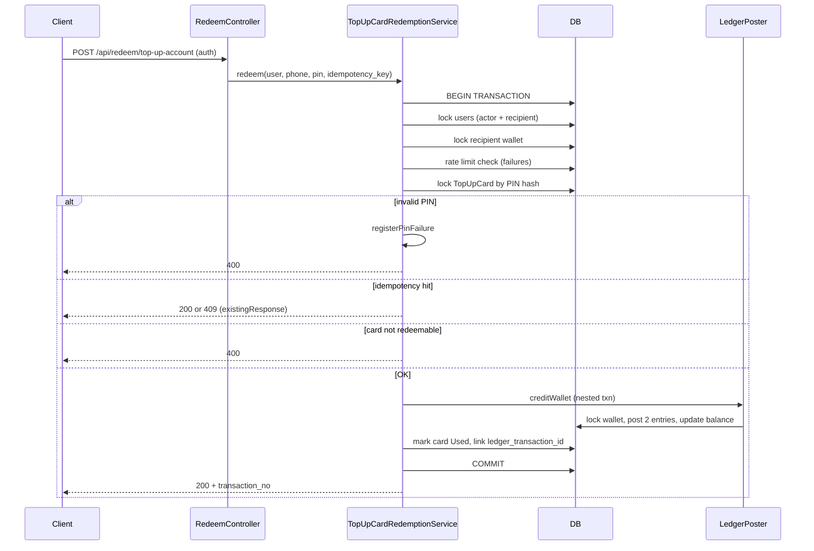

# Top-Up Card Redemption — Security Audit

**Date:** 2026-09-30  
**Scope:** `TopUpCardRedemptionService::redeem`, `RedeemController`, `TopUpAccountRequest`, `SerialNoCheckRequest`, `LedgerPoster::creditWallet`, `TopUpCardPin`, DB schema (`top_up_card`, `ledger_transactions`, `ledger_entries`), API routes under `auth:sanctum`.  
**Out of scope:** Batch card generation and plaintext PIN export (test-only, not production).  
**Reviewer role:** Security-focused backend review (design + implementation).

---

## Executive summary

| Item | Result |
|------|--------|
| **Overall verdict** | **PARTIAL** |
| **Production-ready?** | **No** until required fixes are applied |
| **Primary strength** | Row locking, HMAC PIN storage, global idempotency with strict replay validation, double-entry ledger posting |
| **Primary gap** | Wrong attribute `wallet_transaction_id` (should be `ledger_transaction_id`) weakens replay/duplicate-redemption guards |

---

## Components reviewed

| Component | Path |
|-----------|------|
| Redemption service | `app/Services/TopUpCard/TopUpCardRedemptionService.php` |
| API controller | `app/Http/Controllers/Api/Redeem/RedeemController.php` |
| Request validation | `app/Http/Requests/Api/Redeem/TopUpAccountRequest.php` |
| Serial check | `app/Http/Requests/Api/Redeem/SerialNoCheckRequest.php` |
| Ledger posting | `app/Services/Ledger/LedgerPoster.php` |
| PIN handling | `app/Support/TopUpCardPin.php` |
| Models | `app/Models/TopUpCard.php`, `LedgerTransaction.php`, `LedgerEntry.php`, `Wallet.php` |
| Routes | `routes/api.php` (`/api/redeem/*`) |
| Tests (coverage signal) | `tests/Feature/TopUpCardRedeemApiTest.php` |
| Migrations | `2026_08_31_040000_create_top_up_card_table.php`, `2026_08_19_060007_create_ledger_transactions_table.php`, `2026_08_19_060008_create_ledger_entries_table.php` |

---

## Requirement areas — summary table

| Area | Verdict | Notes |
|------|---------|-------|
| Brute-force protection | PARTIAL | Failed-PIN limits strong; serial oracle + weak PIN policy gaps |
| Replay-attack protection | PARTIAL | Idempotency strong; **ledger link guard bug** |
| Integrity | PASS* | *Except card–ledger link check (Finding G) |
| Atomicity | PARTIAL | Outer transaction OK; nested `LedgerPoster` transaction adds risk surface |
| Fraud protection | PARTIAL | Concurrency on card lock OK; actor status / third-party top-up policy gaps |
| Double-ledger system | PASS | Balanced two-line posts; immutability is app-level only |
| Concurrency / races | PARTIAL | Lock ordering good; tests still reference removed wallet tables |
| Authentication & authorization | PARTIAL | Sanctum required; actor not required active |
| Input validation | PARTIAL | Phone/PIN/idempotency OK; enumeration via phone |
| Auditability | PASS | Actor, IP, UA, transaction_no, card redemption fields |
| Failure / recovery | PARTIAL | Idempotent replay OK; some ledger errors may 500 |
| Business-logic attacks | PARTIAL | Status/expiry OK; depends on fixing G |

---

## Detailed findings

Each finding includes: **Verdict**, **Weakness**, **Attack scenario**, **Why vulnerable**, **Severity**, **Recommended fix**, **Fix type** (code / DB / transactions / locking / infrastructure).

---

### 1. Brute-force protection

#### 1A — Failed-PIN rate limits (user + IP)

| Field | Value |
|-------|-------|
| **Verdict** | **PASS** |
| **Weakness** | None for this control |
| **Attack scenario** | Attacker brute-forces PINs via API |
| **Why current code helps** | `registerPinFailure` after invalid/unavailable outcomes: 10 failures / 30 min per authenticated user, 20 / hour per IP; HTTP 429 with `Retry-After`. Successful redeems do not consume failure budget |
| **Severity** | N/A |
| **Recommended fix** | None |
| **Fix requires** | Production cache/Redis for `RateLimiter` |

#### 1B — No throttle on successful redemptions

| Field | Value |
|-------|-------|
| **Verdict** | **PARTIAL** |
| **Weakness** | Only failed attempts are rate-limited; route `throttle:60,1` is generic |
| **Attack scenario** | Attacker redeems many stolen PINs quickly before operational response |
| **Why vulnerable** | Success path has no dedicated redeem quota |
| **Severity** | Low (with high-entropy PINs) |
| **Recommended fix** | Optional per-user cap on successful redemptions per hour |
| **Fix requires** | Code + infrastructure |

#### 1C — Serial number oracle (`POST /api/redeem/check-serial-no`)

| Field | Value |
|-------|-------|
| **Verdict** | **PARTIAL** |
| **Weakness** | Distinct messages for active / used / expired / blocked / invalid |
| **Attack scenario** | Authenticated user enumerates serials to find active cards before PIN guessing |
| **Why vulnerable** | `RedeemController::checkSerialNo` leaks lifecycle state without PIN |
| **Severity** | Medium |
| **Recommended fix** | Single generic message for all non-success cases; separate rate limit; or require PIN |
| **Fix requires** | Code (+ optional infrastructure) |

#### 1D — PIN length / format

| Field | Value |
|-------|-------|
| **Verdict** | **PARTIAL** |
| **Weakness** | `pin`: required, `max:128`, no minimum or digit-only rule |
| **Attack scenario** | Weak PINs on manually activated cards easier to brute force over time |
| **Why vulnerable** | Validation does not enforce issuance-strength policy |
| **Severity** | Low–Medium |
| **Recommended fix** | Min length (e.g. 12–16), numeric format if applicable |
| **Fix requires** | Code |

---

### 2. Replay-attack protection

#### 2E — Client idempotency + ledger uniqueness

| Field | Value |
|-------|-------|
| **Verdict** | **PASS** |
| **Weakness** | None |
| **Attack scenario** | Network retry replays same redemption request |
| **Why current code helps** | Unique `ledger_transactions.idempotency_key`; `existingResponse()` validates wallet, type, status, linked card, and balanced entries; mismatch → 409 |
| **Severity** | N/A |
| **Recommended fix** | None |
| **Fix requires** | DB unique constraint (present) |

#### 2F — Same PIN, new idempotency key (used card)

| Field | Value |
|-------|-------|
| **Verdict** | **PASS** (normal operation) |
| **Attack scenario** | Attacker reuses PIN after successful redemption |
| **Why current code helps** | Card row `lockForUpdate()`; after success `status = Used`, `redeemed_at` set; retry fails with generic 400 |
| **Severity** | N/A |
| **Recommended fix** | None for happy path |
| **Fix requires** | Row locking (present) |

#### 2G — Wrong field: `wallet_transaction_id` vs `ledger_transaction_id` ⚠️

| Field | Value |
|-------|-------|
| **Verdict** | **FAIL** |
| **Weakness** | Guard uses non-existent column name |

```php
// TopUpCardRedemptionService.php (~line 124–128)
$card->wallet_transaction_id !== null  // BUG: schema uses ledger_transaction_id
```

| **Attack scenario** | DB row inconsistent: `status = active`, `redeemed_at = null`, but `ledger_transaction_id` set (migration bug, manual SQL, future regression) → second redemption credits wallet again |
| **Why vulnerable** | Eloquent attribute always null; ledger link never blocks redemption |
| **Severity** | **High** (Critical if ledger/card state can diverge) |
| **Recommended fix** | Use `$card->ledger_transaction_id !== null`; atomic update `WHERE status = active AND redeemed_at IS NULL AND ledger_transaction_id IS NULL`; `UNIQUE(ledger_transaction_id)` where not null |
| **Fix requires** | Code + DB constraints + transactions |

#### 2H — No DB “one redemption per card” invariant

| Field | Value |
|-------|-------|
| **Verdict** | **PARTIAL** |
| **Weakness** | App-only enforcement of single use |
| **Attack scenario** | Same as 2G if application checks skipped |
| **Why vulnerable** | No DB constraint tying one completed top-up ledger to one card |
| **Severity** | Medium |
| **Recommended fix** | Unique partial index / trigger on card redemption state |
| **Fix requires** | DB constraints |

---

### 3. Integrity

#### 3I — Redeem amount from card row only

| Field | Value |
|-------|-------|
| **Verdict** | **PASS** |
| **Attack scenario** | Client sends arbitrary amount in body |
| **Why current code helps** | Request has no amount field; `$amount = (int) $card->amount` |
| **Severity** | N/A |
| **Recommended fix** | None |
| **Fix requires** | — |

#### 3J — Max wallet balance

| Field | Value |
|-------|-------|
| **Verdict** | **PASS** (redeem path) / **PARTIAL** (system) |
| **Weakness** | `MAX_WALLET_BALANCE` only in redemption service, not `LedgerPoster` |
| **Attack scenario** | Other credit paths bypass cap |
| **Severity** | Low (redeem); Medium (platform) |
| **Recommended fix** | Centralize cap in `LedgerPoster::post` or DB CHECK |
| **Fix requires** | Code (+ optional DB) |

#### 3K — PIN storage

| Field | Value |
|-------|-------|
| **Verdict** | **PASS** (high-entropy PIN policy) |
| **Why current code helps** | HMAC-SHA256 with pepper; lookup by hash; `hash_equals`; dummy compare when card missing |
| **Severity** | N/A |
| **Recommended fix** | Store pepper in secrets manager; document APP_KEY rotation |
| **Fix requires** | Infrastructure / ops |

---

### 4. Atomicity

#### 4L — Outer `DB::transaction` wraps redeem + card update

| Field | Value |
|-------|-------|
| **Verdict** | **PASS** (intent) |
| **Why current code helps** | Ledger credit and card mark-used intended to commit or roll back together |
| **Severity** | N/A |
| **Fix requires** | Transactions (present) |

#### 4M — Nested transaction in `LedgerPoster::post`

| Field | Value |
|-------|-------|
| **Verdict** | **PARTIAL** |
| **Weakness** | Inner `DB::transaction` re-locks wallet inside outer redeem transaction |
| **Attack scenario** | Refactor or misconfiguration splits commit boundaries |
| **Severity** | Low (Laravel savepoints typically roll back with outer) |
| **Recommended fix** | Avoid nested transaction when caller already holds locks |
| **Fix requires** | Code refactor |

---

### 5. Fraud protection

#### 5O — Concurrent redeem, same PIN, different idempotency keys

| Field | Value |
|-------|-------|
| **Verdict** | **PASS** |
| **Why current code helps** | `TopUpCard` locked by PIN hash; second request sees `Used` or fails status checks |
| **Recommended fix** | Add automated concurrent integration test |
| **Fix requires** | Tests |

#### 5P — Concurrent same idempotency key

| Field | Value |
|-------|-------|
| **Verdict** | **PASS** |
| **Why current code helps** | Unique key + `UniqueConstraintViolationException` → 409; `LedgerPoster` returns existing row |
| **Fix requires** | DB + code (present) |

#### 5Q — Top-up arbitrary phone (third party)

| Field | Value |
|-------|-------|
| **Verdict** | **PARTIAL** (product policy) |
| **Weakness** | Any authenticated user may credit any active recipient if PIN + phone known |
| **Attack scenario** | Stolen PIN credited to attacker-chosen phone (first redeem wins) |
| **Why** | By design; `redeemed_by` records actor only |
| **Severity** | Low–Medium |
| **Recommended fix** | If self-only: require `phone === actor.phone` or explicit delegation |
| **Fix requires** | Code + product rules |

#### 5R — Authenticated actor status not validated

| Field | Value |
|-------|-------|
| **Verdict** | **PARTIAL** |
| **Weakness** | Only recipient must be `UserStatus::Active`; actor unchecked |
| **Attack scenario** | Suspended user with valid Sanctum token tops up another user’s wallet |
| **Severity** | Medium |
| **Recommended fix** | Require active actor; revoke tokens on suspend; API middleware |
| **Fix requires** | Code + auth lifecycle |

---

### 6. Double-ledger system

#### 6S — Balanced double entry

| Field | Value |
|-------|-------|
| **Verdict** | **PASS** |
| **Why current code helps** | `creditWallet`: CashTopup debit + customer liability credit; `post()` enforces balance; `existingResponse()` re-validates |
| **Fix requires** | Code (present) |

#### 6T — Ledger immutability

| Field | Value |
|-------|-------|
| **Verdict** | **PARTIAL** |
| **Weakness** | No DB-level append-only enforcement on `ledger_entries` |
| **Severity** | Low (insider / compromised DB) |
| **Recommended fix** | Restricted DB roles, audit triggers |
| **Fix requires** | Infrastructure / DB |

---

### 7. Concurrency / locking

#### 7U — Lock ordering

| Field | Value |
|-------|-------|
| **Verdict** | **PASS** |
| **Why current code helps** | Users by ascending id + `lockForUpdate()` → wallet → card |
| **Fix requires** | Locking (present) |

#### 7V — Double wallet lock

| Field | Value |
|-------|-------|
| **Verdict** | **PARTIAL** |
| **Weakness** | Wallet locked in service and again in `LedgerPoster` |
| **Severity** | Low (deadlock risk vs other features) |
| **Recommended fix** | Document global lock order across services |
| **Fix requires** | Code conventions |

#### 7X — Test suite drift (ledger migration)

| Field | Value |
|-------|-------|
| **Verdict** | **PARTIAL** |
| **Weakness** | `TopUpCardRedeemApiTest` references removed `WalletTransaction` / `WalletEntry` |
| **Severity** | Medium (process / regression) |
| **Recommended fix** | Rewrite tests for `LedgerTransaction` / `LedgerEntry`; add parallel redeem test |
| **Fix requires** | Tests |

---

### 8. Authentication & authorization

#### 8Y — Sanctum on redeem routes

| Field | Value |
|-------|-------|
| **Verdict** | **PASS** |
| **Why** | `routes/api.php`: `auth:sanctum` on redeem group |

---

### 9. Input validation

#### 9AA — Phone handling

| Field | Value |
|-------|-------|
| **Verdict** | **PASS** |
| **Why** | Normalize + regex; post-load phone match on account |

#### 9AB — Phone enumeration

| Field | Value |
|-------|-------|
| **Verdict** | **PARTIAL** |
| **Weakness** | Unknown phone → 404 before PIN check |
| **Severity** | Low–Medium |
| **Recommended fix** | Generic error message |
| **Fix requires** | Code |

---

### 10. Auditability

#### 10AD — Trace fields

| Field | Value |
|-------|-------|
| **Verdict** | **PASS** |
| **Fields** | `LedgerTransaction`: `transaction_no`, `actor_type`, `actor_id`, `ip_address`, `user_agent`, `posted_at`, `idempotency_key`; card: `redeemed_by`, `redeemed_at`, `ledger_transaction_id` |

---

### 11. Failure / recovery

#### 11AE — Idempotent client recovery

| Field | Value |
|-------|-------|
| **Verdict** | **PASS** |
| **Why** | Valid replay → 200; key misuse → 409 |

#### 11AF — Overflow without consuming card

| Field | Value |
|-------|-------|
| **Verdict** | **PASS** |
| **Why** | Balance cap check before post; card stays active on 409 |

#### 11AG — Ledger `ValidationException`

| Field | Value |
|-------|-------|
| **Verdict** | **PARTIAL** |
| **Weakness** | Uncaught → HTTP 500 |
| **Severity** | Low |
| **Recommended fix** | Map to structured 4xx in service |
| **Fix requires** | Code |

---

## Redemption flow (reference)



---

## Controls matrix (special focus)

| Threat | Status | Primary control |
|--------|--------|-----------------|
| Duplicate redemption | PARTIAL | Row lock + status; **fix G** |
| Double spending | PARTIAL | Same as duplicate redemption |
| Replay (HTTP) | PASS | Idempotency key + validation |
| Replay (voucher) | PARTIAL | Status/redeemed_at; **fix G** |
| Concurrent requests | PASS | `lockForUpdate` on card |
| Transaction rollback | PASS | Outer transaction (verify nested) |
| Ledger imbalance | PASS | `LedgerPoster` balance checks |
| Negative/modified amounts | PASS | Amount from DB card row |
| Unauthorized user redemption | PARTIAL | Sanctum; actor status gap (5R) |
| Predictable codes | Out of scope | Production issuance not batch test flow |
| Brute-force enumeration | PARTIAL | Failure limits + serial oracle |
| Idempotency | PASS | Global unique key |
| DB constraints | PARTIAL | Idempotency unique; card link weak |
| Deadlocks | PASS | User id ordering |
| Lost updates | PASS | Wallet row lock + version increment |
| Audit-log manipulation | PARTIAL | App immutability only |

---

## Security verdict

| | |
|---|---|
| **Overall** | **PARTIAL** |
| **Critical in consistent DB + normal code path** | No trivial exploit if `status` / `redeemed_at` always updated with ledger |
| **High-priority defect** | Finding **2G** (`wallet_transaction_id` typo) |

### Required fixes before production

1. Fix **2G**: `ledger_transaction_id` guard + conditional update + DB uniqueness where appropriate.
2. Restore **ledger-based** feature tests and add **concurrent duplicate-PIN** test (**7X**).
3. Define and enforce **actor policy** (**5Q**, **5R**): active actor only; self vs third-party top-up.
4. Confirm **RateLimiter** uses durable backend (Redis) in production.

### Optional hardening

- Serial check response normalization (**1C**)
- PIN minimum length (**1D**)
- Generic phone lookup errors (**9AB**)
- Success-path redeem rate limits (**1B**)
- Central max balance in ledger (**3J**)
- Flatten nested ledger transactions (**4M**)
- Append-only ledger at DB layer (**6T**)

---

## Appendix: Key constants (service)

| Constant | Value |
|----------|-------|
| `MAX_WALLET_BALANCE` | 2147483647 |
| `FAILED_PIN_LIMIT_PER_USER` | 10 / 30 min |
| `FAILED_PIN_LIMIT_PER_IP` | 20 / 1 hour |

---

## Document history

| Version | Date | Notes |
|---------|------|-------|
| 1.0 | 2026-09-30 | Initial audit from code review |
